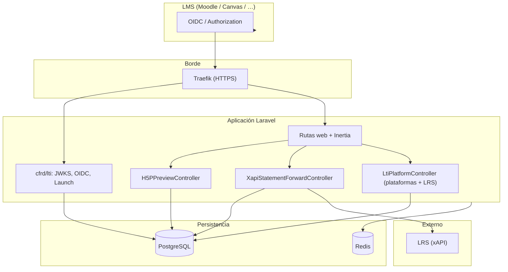
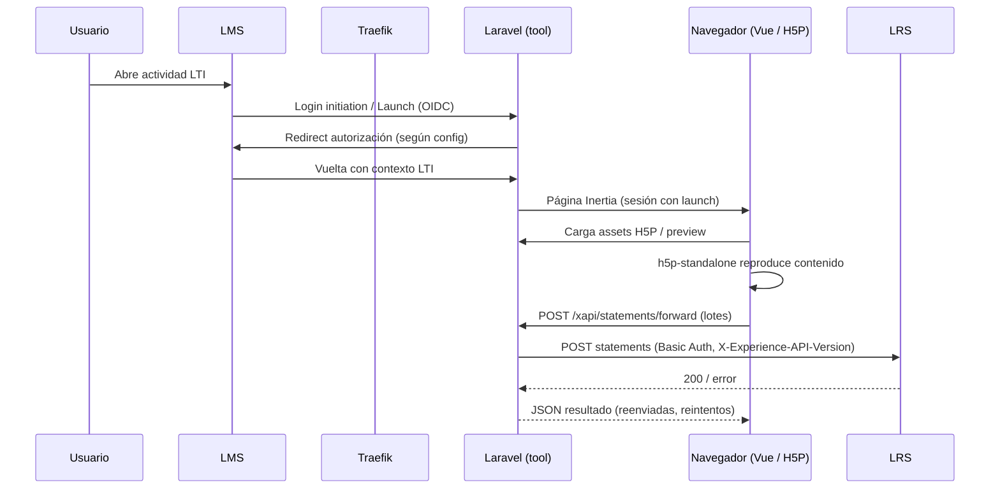

# Visor H5P · LTI · LRS (PDDP)

Aplicación web para **visualizar paquetes H5P**, integrarlas en **LMS mediante LTI 1.3 (OIDC)** y **reenviar trazas xAPI** a un **LRS** configurable por plataforma. Pensada para operar detrás de **Traefik** en un stack con **PostgreSQL** y **Redis**.

## Contexto

El proyecto sirve como herramienta tipo “tool” LTI: el usuario lanza la actividad desde un LMS (p. ej. Moodle o Canvas), la sesión LTI queda establecida en el servidor y el cliente carga el contenido H5P con **h5p-standalone**. Las interacciones que emiten statements xAPI se capturan en el navegador y se envían al backend, que las normaliza (incluyendo contexto LTI en extensiones) y las reenvía al LRS asociado a la plataforma.

## Stack tecnológico

| Capa | Tecnología |
|------|------------|
| Backend | PHP 8.4, **Laravel 13** |
| Frontend | **Vue 3**, **Inertia.js v3**, **Tailwind CSS v4**, **Vite** |
| Auth UI / API | **Laravel Fortify** |
| Rutas tipadas | **Laravel Wayfinder** (`@/routes`, `@/actions`) |
| LTI | Paquete local **`cfrd/lti`** (`cfrd-lti/`): JWKS, login initiation OIDC, launch |
| H5P en cliente | **`h5p-standalone`** (assets copiados a `public/vendor/h5p-standalone` en `postinstall`) |
| Datos | **PostgreSQL** (despliegue CFRD), **Redis** (caché, sesión, colas opcionales) |
| Contenedor | Apache + PHP (`ContenedorPrevencionDelitoPreviewH5P/apache/`), orquestación en `deploy/cfrd-stack/` |

## Funcionalidades principales

- **Subida y previsualización de `.h5p`**: extracción del ZIP, URLs con token para assets y reproducción embebida (página principal / vista Inertia).
- **LTI 1.3**: endpoints del paquete CFRD (`/lti/jwks.json`, `/lti/oauth/login-initiation`, `/lti/launch`) y flujo OIDC hacia el LMS (`/lti/oauth/authorize`).
- **Administración de plataformas LTI**: CRUD de plataformas (issuer, client_id, JWKS, endpoints OIDC) y sincronización de JWKS.
- **Conexiones LRS por plataforma**: URL del endpoint xAPI, versión, autenticación básica, prueba de conectividad.
- **Reenvío xAPI**: `POST /xapi/statements/forward` agrupa statements desde el cliente, enriquece con datos de la última sesión LTI y las envía al LRS resuelto para el issuer actual.
- **Autenticación de usuarios** (Fortify) y equipos (`teams`), según migraciones y páginas existentes.

## Arquitectura lógica



## Flujo LTI + reproducción H5P + xAPI



## Requisitos locales

- PHP 8.3+ (8.4 recomendado, alineado con Docker), Composer, Node.js 22+, extensiones PHP habituales de Laravel (`pdo`, `intl`, `zip`, etc.) y **pdo_pgsql** si usas PostgreSQL.

## Puesta en marcha (desarrollo)

1. `cp .env.example .env` y configurar `APP_URL`, base de datos y variables **`LTI_*`** según tu LMS (ver `.env.example` y el paquete `cfrd-lti`).
2. `composer install`
3. `php artisan key:generate`
4. `php artisan migrate`
5. `npm install` (ejecuta `postinstall`: copia **h5p-standalone** a `public/vendor/h5p-standalone`)
6. `php artisan wayfinder:generate`
7. `npm run dev` (o `npm run build` para assets de producción)

Pruebas automatizadas (ejemplos):

```bash
php artisan test --compact
php artisan test --compact tests/Feature/Lti
php artisan test --compact tests/Feature/H5PPreviewControllerTest.php
```

## Despliegue CFRD (referencia)

- Manifiesto de ejemplo: `deploy/cfrd-stack/docker-compose.yml` (red externa **`microservicios_service_net`**, etiquetas Traefik, variables en `deploy/cfrd-stack/env.laravel.fragment.example`).
- El contenedor ejecuta `ContenedorPrevencionDelitoPreviewH5P/apache/init.sh`: instala dependencias PHP, y si hace falta corre **`npm ci`** y **`npm run build`** cuando no hay manifiesto de Vite.
- Alinear credenciales **`DB_*`** con el PostgreSQL del stack; no versionar `.env` con secretos.

Antes de levantar contenedores en entornos compartidos, conviene confirmar el procedimiento con el equipo de infraestructura (red Docker, DNS y TLS en Traefik).

## Estructura relevante

| Ruta | Rol |
|------|-----|
| `routes/web.php` | Home, H5P preview, plataformas LTI, LRS, OIDC authorize, forward xAPI |
| `cfrd-lti/routes/lti.php` | JWKS, login initiation, launch |
| `app/Http/Controllers/H5PPreviewController.php` | Subida y entrega de assets H5P |
| `app/Http/Controllers/XapiStatementForwardController.php` | Normalización y envío al LRS |
| `app/Http/Controllers/LtiPlatformController.php` | Plataformas y conexiones LRS |
| `resources/js/pages/Welcome.vue` | Visor H5P, captura xAPI, UI LTI |
| `deploy/cfrd-stack/` | Compose y fragmento de `.env` para el stack |

## Licencia

MIT (según `composer.json` del esqueleto Laravel; revisar si el producto final define otra licencia).
