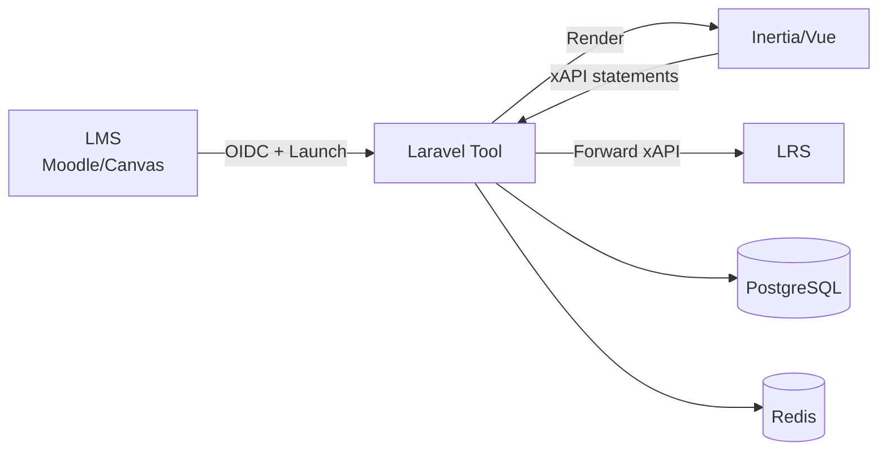
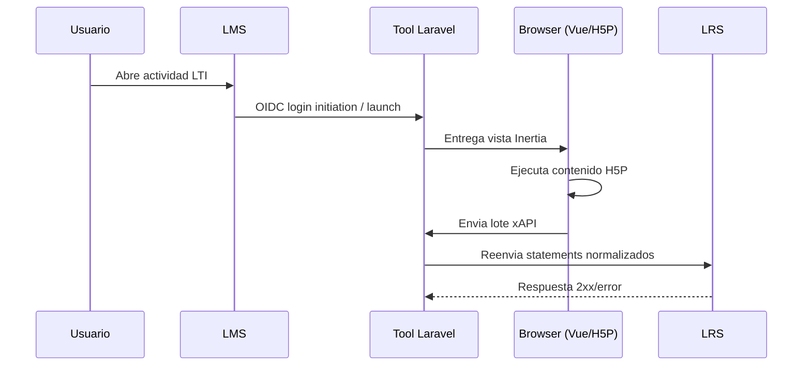

# Visor H5P · LTI · LRS

Aplicacion web para visualizar contenidos H5P, integrarlos en LMS mediante LTI 1.3 (OIDC) y reenviar eventos xAPI a un LRS configurable. El proyecto esta pensado para operacion institucional en CFRD, detras de Traefik, con PostgreSQL y Redis.

## Objetivo

Centralizar la previsualizacion/ejecucion de paquetes H5P y su trazabilidad de aprendizaje (xAPI), permitiendo:

- consumo desde Moodle/Canvas via LTI 1.3,
- administracion de plataformas LMS y conexiones LRS,
- reenvio robusto de statements xAPI enriquecidos con contexto LTI.

## Funcionalidades

- Subida y previsualizacion de archivos `.h5p`.
- Servido de assets H5P con URL protegida por token.
- Endpoints LTI 1.3 (JWKS, login initiation, launch) desde paquete local `cfrd/lti`.
- Flujo OIDC de autorizacion hacia el LMS.
- Administracion de plataformas LTI (issuer, client_id, JWKS, endpoints).
- Gestion de conexiones LRS por plataforma (endpoint, credenciales, version xAPI).
- Forward de statements xAPI: `POST /xapi/statements/forward`.
- Acceso protegido por contrasena para `/lti/plataformas` y acciones de administracion.

## Stack tecnologico

| Capa | Tecnologia |
|------|------------|
| Backend | PHP 8.4, Laravel 13 |
| Frontend | Vue 3, Inertia.js v3, Tailwind CSS v4, Vite 8 |
| Seguridad/Auth | Laravel Fortify + acceso adicional por contrasena para modulo LTI |
| Integracion LTI | Paquete local `cfrd/lti` |
| H5P | `h5p-standalone` |
| Datos | PostgreSQL + Redis |
| Despliegue | Docker + Apache + Traefik |

## Arquitectura (alto nivel)



## Flujo funcional



## Estructura principal

| Ruta | Proposito |
|------|-----------|
| `routes/web.php` | Rutas de preview H5P, administracion LTI/LRS y xAPI |
| `cfrd-lti/routes/lti.php` | Endpoints LTI core (JWKS, OIDC, launch) |
| `app/Http/Controllers/H5PPreviewController.php` | Upload y entrega de assets H5P |
| `app/Http/Controllers/LtiPlatformController.php` | CRUD de plataformas + LRS |
| `app/Http/Controllers/XapiStatementForwardController.php` | Normalizacion y envio xAPI al LRS |
| `resources/js/pages/Welcome.vue` | Visor H5P y captura de eventos xAPI |
| `resources/js/pages/LtiPlatforms.vue` | UI de administracion LTI/LRS con acceso protegido |
| `deploy/cfrd-stack/` | Archivos de despliegue para stack CFRD |

## Requisitos

- PHP 8.3+ (recomendado 8.4).
- Composer 2+.
- Node.js 22 (Node 20.19+ tambien puede funcionar).
- Extensiones PHP: `pdo`, `pdo_pgsql`, `intl`, `zip`, `bcmath`, `opcache`.

## Instalacion local

```bash
cp .env.example .env
composer install
php artisan key:generate
php artisan migrate
npm install
php artisan wayfinder:generate
npm run dev
```

## Variables de entorno clave

- `APP_URL`, `ASSET_URL`
- `DB_*` (pgsql en entorno CFRD)
- `REDIS_*`
- `LTI_TOOL_*`
- `LTI_PLATFORM_*`
- `LTI_OIDC_ALLOWED_TARGET_URIS`
- `LTI_PLATFORMS_PASSWORD` (acceso a `/lti/plataformas`)

## Pruebas

```bash
php artisan test --compact
php artisan test --compact tests/Feature/Lti
```

## Despliegue CFRD

- Host publico esperado: `pddp.cfrd.cl`.
- Red externa del stack: `microservicios_service_net` (o `CFRD_STACK_NETWORK`).
- Publicacion via Traefik (sin exponer puertos directos de app).
- Referencia de compose: `deploy/cfrd-stack/docker-compose.yml`.

## Licencia

MIT.
